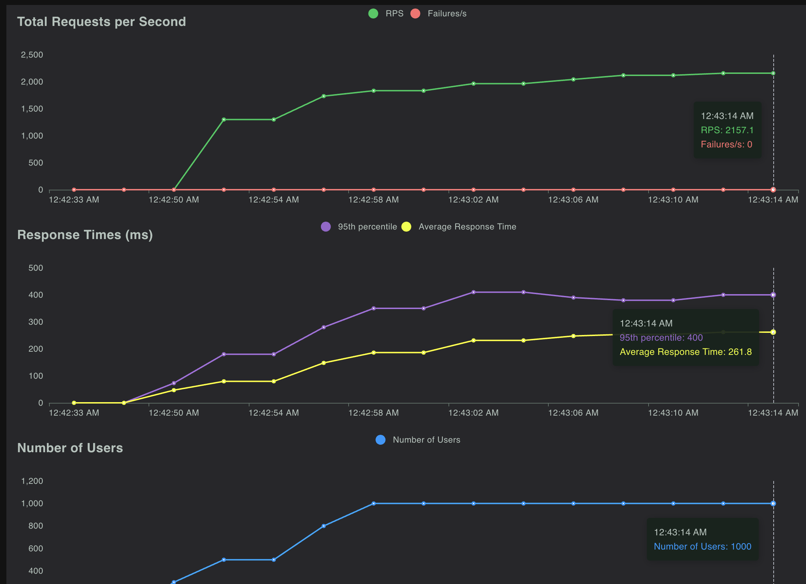

# LEAD: High Performance Leaderboard Project

## Overview

This project is a high-performance leaderboard application built using cutting-edge technologies. The project consists of a frontend, backend, and database components, each designed to provide optimal performance and scalability.

## Front

- [Vite](https://vitejs.dev/) + [pnpm](https://pnpm.io/): A fast and lightweight development server for rapid prototyping and development.
- [Solid JS](https://www.solidjs.com/): A high-performance JavaScript framework for building scalable and efficient user interfaces.
- [Tailwind CSS](https://tailwindcss.com/): A utility-first CSS framework for rapid styling and layout design.

## Back

- [Rust](https://www.rust-lang.org/): A systems programming language that provides memory safety guarantees and performance.
- [Actix](https://actix.rs/): A Rust framework for building fast, scalable, and concurrent web applications.

## DB

- [Redis](https://redis.io/): An in-memory data store that provides high-performance caching and data storage.

## High Load Test

- [Locust](https://locust.io/): A distributed load testing tool for simulating high traffic and stress testing the application.

#### Test Results

## Dev. Env. Setup

To set up the development environment, follow these steps:

1. Start Redis:

   > cd db
   > redis-server

2. Start the backend:

   > cd back
   > cargo run

3. Start the frontend:

   > cd front
   > pnpm dev

4. Run Load Tests (Optional):

   > cd test
   > locust -f locustfile.py -H http://127.0.0.1:8080
